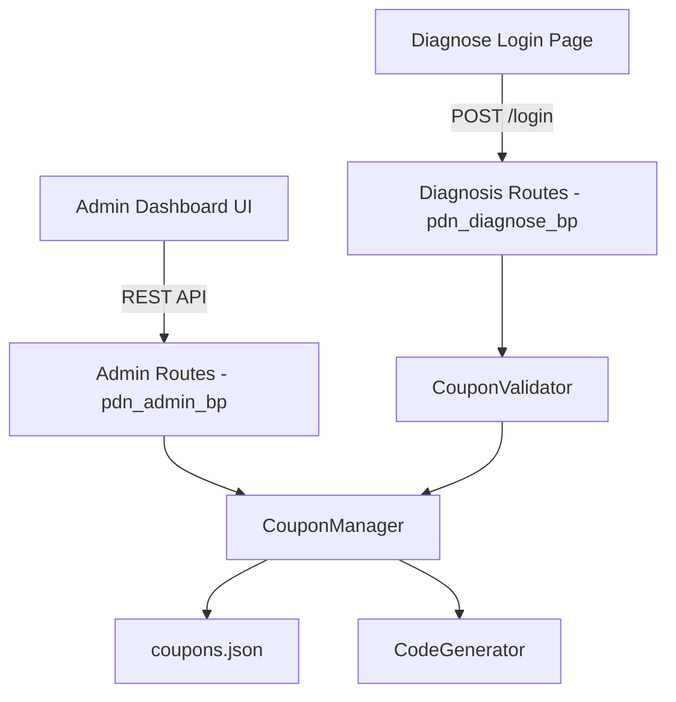

# Design Document: Coupon Management

## Overview

The Coupon Management feature adds a coupon system to the PDN admin dashboard, allowing administrators to create, manage, and track promotional coupons. Users can redeem coupons on the questionnaire login page to gain access without individual credentials. The system uses JSON file-based storage consistent with the existing project architecture.

## Architecture

The feature follows the existing Flask blueprint pattern with JSON file persistence:



**Key architectural decisions:**
- **JSON file storage**: Consistent with existing `users.json` pattern. Thread-safe with file locking.
- **In-memory caching**: Like `UserManager`, the `CouponManager` loads data into memory and persists on write.
- **Blueprint integration**: Coupon admin routes are added to the existing `pdn_admin_bp` blueprint.
- **Validation at login**: The diagnose login route is extended to accept coupon codes as an alternative authentication method.

## Components and Interfaces

### 1. CouponManager (`app/pdn_admin/coupon_manager.py`)

Core module for CRUD operations on coupons.

```python
class CouponManager:
    def __init__(self, json_path: Optional[Path] = None):
        """Initialize with path to coupons.json, load into memory."""
        
    def create_coupon(self, name: str, max_usage: int, code: Optional[str] = None) -> dict:
        """Create a new coupon. Auto-generates code if not provided.
        Returns the created coupon dict.
        Raises ValueError if code is duplicate or invalid."""
        
    def get_coupon(self, code: str) -> Optional[dict]:
        """Get a single coupon by code. Returns None if not found."""
        
    def get_all_coupons(self) -> list:
        """Return all coupons as a list of dicts."""
        
    def update_coupon(self, code: str, **updates) -> dict:
        """Update coupon fields (name, max_usage). Code is immutable.
        Raises KeyError if not found, ValueError if invalid updates."""
        
    def delete_coupon(self, code: str) -> None:
        """Delete a coupon by code. Raises KeyError if not found."""
        
    def redeem_coupon(self, code: str, email: str) -> dict:
        """Record a coupon redemption. Increments usage_count, adds email to used_by.
        Raises ValueError if coupon is full or not found."""
        
    def validate_coupon(self, code: str) -> tuple[bool, str]:
        """Check if a coupon code is valid and has remaining uses.
        Returns (is_valid, message)."""
        
    def get_status(self, coupon: dict) -> str:
        """Derive status from usage_count and max_usage."""
```

### 2. CodeGenerator (`app/pdn_admin/coupon_manager.py`)

Utility function within the coupon manager module.

```python
def generate_coupon_code(existing_codes: set) -> str:
    """Generate a unique 8-character alphanumeric code [A-Z0-9].
    Checks against existing_codes to ensure uniqueness."""

def validate_custom_code(code: str) -> tuple[bool, str]:
    """Validate a custom code: 4-20 alphanumeric characters.
    Returns (is_valid, error_message)."""
```

### 3. Admin API Routes (added to `app/pdn_admin/admin_routes.py`)

```
GET    /pdn-admin/coupons              - List all coupons
POST   /pdn-admin/coupons              - Create a new coupon
PUT    /pdn-admin/coupons/<code>       - Update a coupon
DELETE /pdn-admin/coupons/<code>       - Delete a coupon
GET    /pdn-admin/coupons/<code>/usage - Get usage details for a coupon
```

All admin routes require session authentication via `verify_session()`.

### 4. Diagnose Login Extension (modified in `app/pdn_diagnose/diagnosis_routes.py`)

The existing `POST /pdn-diagnose/login` endpoint is extended to accept a `coupon_code` field. When present, it validates the coupon instead of checking email/password.

### 5. Coupon Widget (added to `app/pdn_admin/templates/admin_dashboard.html`)

A new section in the admin dashboard that displays:
- Coupon list table with code, name, usage/max, status badge
- Create coupon form with auto-generated code preview
- Edit/delete actions per coupon
- Usage details modal showing redeemed emails

## Data Models

### Coupon Record (stored in `app/data/coupons.json`)

```json
{
  "ABCD1234": {
    "name": "Workshop March 2025",
    "code": "ABCD1234",
    "max_usage": 50,
    "usage_count": 12,
    "used_by": ["user1@example.com", "user2@example.com"],
    "created_at": "2025-03-01 10:30",
    "updated_at": "2025-03-15 14:20"
  }
}
```

**Field descriptions:**
- `name` (string): Human-readable label for the coupon
- `code` (string): The unique coupon code (key in the JSON object)
- `max_usage` (integer, >= 1): Maximum number of redemptions allowed
- `usage_count` (integer, >= 0): Current number of redemptions
- `used_by` (list of strings): Email addresses of users who redeemed this coupon
- `created_at` (string): ISO-like timestamp of creation
- `updated_at` (string): ISO-like timestamp of last modification

### Status Derivation

Status is computed, not stored:
- `"active"`: `usage_count < max_usage`
- `"full"`: `usage_count >= max_usage`

## Correctness Properties

*A property is a characteristic or behavior that should hold true across all valid executions of a system — essentially, a formal statement about what the system should do. Properties serve as the bridge between human-readable specifications and machine-verifiable correctness guarantees.*

### Property 1: Code generation format

*For any* generated coupon code, it SHALL consist of exactly 8 characters drawn exclusively from the character set [A-Z, 0-9].

**Validates: Requirements 1.1, 6.1**

### Property 2: Code uniqueness

*For any* set of existing coupon codes and a newly generated code, the new code SHALL NOT be equal to any existing code in the set.

**Validates: Requirements 1.4, 6.2**

### Property 3: Coupon creation round-trip

*For any* valid coupon creation input (name, max_usage, optional custom code), after creation the stored coupon SHALL contain the correct name, code (custom or generated), max_usage, usage_count of 0, an empty used_by list, and a creation timestamp.

**Validates: Requirements 1.2, 1.3, 1.5**

### Property 4: Status derivation

*For any* coupon with usage_count and max_usage values, the derived status SHALL be "active" if usage_count < max_usage, and "full" if usage_count >= max_usage.

**Validates: Requirements 2.2, 7.1, 7.2, 7.3**

### Property 5: Custom code validation

*For any* string, it SHALL be accepted as a valid custom coupon code if and only if it is between 4 and 20 characters in length and consists entirely of alphanumeric characters [A-Z, a-z, 0-9].

**Validates: Requirements 6.3**

### Property 6: Code immutability

*For any* existing coupon and any update operation, the coupon's code field SHALL remain unchanged after the update completes.

**Validates: Requirements 3.3**

### Property 7: Update persistence

*For any* existing coupon and valid update values for name or max_usage, after the update operation the stored coupon SHALL reflect the new values for the updated fields while preserving all other fields.

**Validates: Requirements 3.1, 3.2**

### Property 8: Deletion removes coupon

*For any* existing coupon, after deletion the coupon SHALL NOT be retrievable from the data store.

**Validates: Requirements 4.1**

### Property 9: Coupon validation correctness

*For any* coupon code submission, access SHALL be granted if and only if the code exists in the data store AND the coupon's usage_count is strictly less than its max_usage.

**Validates: Requirements 5.1, 5.2, 5.3**

### Property 10: Redemption increments usage

*For any* valid coupon and any email address, after successful redemption the coupon's usage_count SHALL equal the previous usage_count plus one, and the email SHALL appear in the coupon's used_by list.

**Validates: Requirements 5.4**

## Error Handling

| Scenario | Response | HTTP Status |
|----------|----------|-------------|
| Duplicate coupon code on create | `{"error": "Coupon code already exists"}` | 409 |
| Invalid custom code format | `{"error": "Code must be 4-20 alphanumeric characters"}` | 400 |
| Coupon not found (edit/delete) | `{"error": "Coupon not found"}` | 404 |
| Invalid max_usage (< 1) | `{"error": "Max usage must be at least 1"}` | 400 |
| Coupon full on redemption | `{"error": "Coupon has reached its usage limit"}` | 403 |
| Invalid coupon code on login | `{"error": "Invalid coupon code"}` | 401 |
| Unauthorized admin request | `{"error": "Invalid or expired session"}` | 401 |
| File I/O error on persistence | Log error, return `{"error": "Internal server error"}` | 500 |

## Testing Strategy

### Property-Based Tests (using Hypothesis)

The project already uses Hypothesis (`.hypothesis/` directory exists). Each correctness property will be implemented as a property-based test with minimum 100 iterations.

- **Property tests** validate universal correctness across random inputs
- **Library**: `hypothesis` (already in use in this project)
- **Location**: `tests/test_coupon_properties.py`
- **Configuration**: `@settings(max_examples=100)`
- **Tagging**: Each test annotated with property number and requirements reference

### Unit Tests

- **Location**: `tests/test_coupon_manager.py`
- Specific examples for edge cases (empty name, max_usage=1, boundary conditions)
- API endpoint tests with Flask test client
- Integration tests for the login flow with coupon validation

### Test Coverage

| Component | Test Type | Focus |
|-----------|-----------|-------|
| CodeGenerator | Property | Format, uniqueness |
| CouponManager.create | Property | Round-trip, duplicate detection |
| CouponManager.update | Property | Persistence, immutability |
| CouponManager.delete | Property | Removal verification |
| CouponManager.validate | Property | Access grant/deny logic |
| CouponManager.redeem | Property | Usage increment |
| Status derivation | Property | Correct status from counts |
| Custom code validation | Property | Accept/reject logic |
| Admin API endpoints | Unit/Integration | HTTP responses, auth |
| Diagnose login with coupon | Integration | End-to-end flow |
