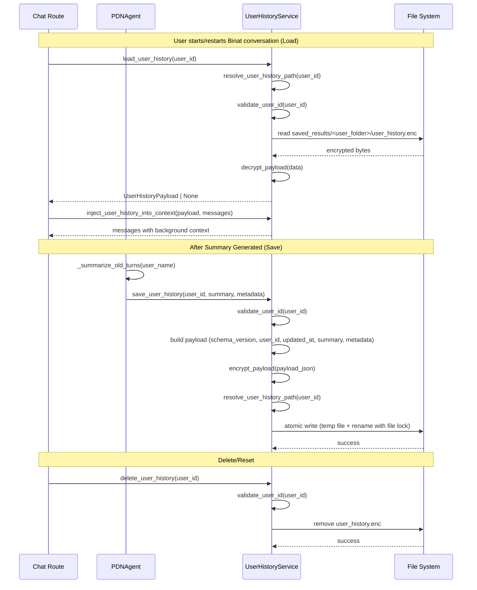

# Design Document: User History Persistence

## Overview

File-based persistence layer for per-user conversation history summaries in the PDN application. Stores an encrypted JSON payload (`user_history.enc`) in each user's `saved_results/<user_folder>/` directory (same location where diagnose answers and audio files are stored), enabling conversation context to survive across sessions.

**Key constraints:**
- History file path: `saved_results/<user_folder>/<email>_history.enc` (same folder as `<email>_answers.json`, audio files, etc.)
- Filename example: `tomergur@gmail_history.enc`
- History is loaded **only when a user starts/restarts a Binat conversation** — NOT on server startup
- Each save fully overrides the previous file content

## Main Algorithm/Workflow



## Core Interfaces/Types

```python
from dataclasses import dataclass, field
from typing import Optional, Dict, Any, List
from datetime import datetime


SCHEMA_VERSION = "1.0"
HISTORY_FILENAME_SUFFIX = "_history.enc"  # e.g., tomergur@gmail_history.enc


@dataclass
class UserHistoryPayload:
    """Structured payload persisted to disk."""
    schema_version: str
    user_id: str
    updated_at: str  # ISO 8601
    summary: str
    metadata: Dict[str, Any] = field(default_factory=dict)

    def to_dict(self) -> Dict[str, Any]:
        return {
            "schema_version": self.schema_version,
            "user_id": self.user_id,
            "updated_at": self.updated_at,
            "summary": self.summary,
            "metadata": self.metadata,
        }

    @classmethod
    def from_dict(cls, data: Dict[str, Any]) -> "UserHistoryPayload":
        return cls(
            schema_version=data["schema_version"],
            user_id=data["user_id"],
            updated_at=data["updated_at"],
            summary=data["summary"],
            metadata=data.get("metadata", {}),
        )
```

## Key Functions with Formal Specifications

### Function 1: save_user_history()

```python
def save_user_history(
    self,
    user_id: str,
    summary: str,
    metadata: Optional[Dict[str, Any]] = None
) -> bool:
    ...
```

**Preconditions:**
- `user_id` is a non-empty string that passes `validate_user_id()`
- `summary` is a non-empty string
- `metadata` is None or a JSON-serializable dict

**Postconditions:**
- Returns `True` if file was written successfully
- File at `resolve_user_history_path(user_id)` contains the encrypted payload
- Previous file content is fully replaced (override semantics)
- Write is atomic: either the full new content is on disk or the old content remains
- No partial writes visible to concurrent readers

**Loop Invariants:** N/A

---

### Function 2: load_user_history()

```python
def load_user_history(self, user_id: str) -> Optional[UserHistoryPayload]:
    ...
```

**Preconditions:**
- `user_id` is a non-empty string that passes `validate_user_id()`

**Postconditions:**
- Returns `UserHistoryPayload` if file exists and is valid
- Returns `None` if file is missing, corrupted, or decryption fails
- Never raises an exception to the caller (graceful degradation)
- Does not modify any file on disk

**Loop Invariants:** N/A

---

### Function 3: delete_user_history()

```python
def delete_user_history(self, user_id: str) -> bool:
    ...
```

**Preconditions:**
- `user_id` is a non-empty string that passes `validate_user_id()`

**Postconditions:**
- Returns `True` if file was deleted or did not exist
- Returns `False` only on unexpected OS errors
- File at `resolve_user_history_path(user_id)` no longer exists
- No path traversal outside the user's designated folder

**Loop Invariants:** N/A

---

### Function 4: inject_user_history_into_context()

```python
def inject_user_history_into_context(
    self,
    payload: Optional[UserHistoryPayload],
    messages: List[Dict[str, str]]
) -> List[Dict[str, str]]:
    ...
```

**Preconditions:**
- `payload` is either `None` or a valid `UserHistoryPayload`
- `messages` is a list of message dicts (LangChain format: `{"role": "...", "content": "..."}`)

**Postconditions:**
- If `payload` is None or summary is empty, returns `messages` unchanged
- If `payload` is valid, inserts a system message with the summary at the beginning of the list (after any existing system message)
- Original messages are preserved in order
- Injected message is clearly marked as previous session context

**Loop Invariants:** N/A

---

### Function 5: encrypt_payload()

```python
def encrypt_payload(self, payload_json: str) -> bytes:
    ...
```

**Preconditions:**
- `payload_json` is a valid JSON string (non-empty)

**Postconditions:**
- Returns bytes that are NOT valid JSON (obfuscated)
- Output is deterministic for the same input (base64 encoding)
- `decrypt_payload(encrypt_payload(x)) == x` for all valid inputs

**Loop Invariants:** N/A

---

### Function 6: decrypt_payload()

```python
def decrypt_payload(self, data: bytes) -> Optional[str]:
    ...
```

**Preconditions:**
- `data` is a non-empty bytes object

**Postconditions:**
- Returns the original JSON string if `data` was produced by `encrypt_payload()`
- Returns `None` if decoding fails (corrupted data)
- Never raises an exception

**Loop Invariants:** N/A

---

### Function 7: resolve_user_history_path()

```python
def resolve_user_history_path(self, user_id: str) -> Path:
    ...
```

**Preconditions:**
- `user_id` passes `validate_user_id()`

**Postconditions:**
- Returns a `Path` object pointing to `<base_dir>/<safe_user_folder>/<email>_history.enc`
- The resolved path is always under `self.base_dir` (no traversal)
- Parent directory is created if it does not exist

**Loop Invariants:** N/A

---

### Function 8: validate_user_id()

```python
def validate_user_id(self, user_id: str) -> bool:
    ...
```

**Preconditions:**
- `user_id` is any string (including potentially malicious input)

**Postconditions:**
- Returns `True` if user_id is non-empty and contains only safe characters
- Returns `False` if user_id contains path traversal sequences (`..`, `/`, `\`, null bytes)
- Returns `False` if user_id is empty or only whitespace
- Pure function with no side effects

**Loop Invariants:** N/A

## Algorithmic Pseudocode

### Save Algorithm (Atomic Write with File Locking)

```python
import os
import json
import base64
import tempfile
import fcntl
from pathlib import Path
from datetime import datetime, timezone


def save_user_history(self, user_id: str, summary: str, metadata: dict = None) -> bool:
    """Persist user history summary with atomic write."""
    # Step 1: Validate inputs
    if not self.validate_user_id(user_id):
        self.logger.warning("Invalid user_id rejected")
        return False
    if not summary or not summary.strip():
        return False

    # Step 2: Build payload
    payload = UserHistoryPayload(
        schema_version=SCHEMA_VERSION,
        user_id=user_id,
        updated_at=datetime.now(timezone.utc).isoformat(),
        summary=summary,
        metadata=metadata or {},
    )

    # Step 3: Serialize and encrypt
    payload_json = json.dumps(payload.to_dict(), ensure_ascii=False)
    encrypted = self.encrypt_payload(payload_json)

    # Step 4: Resolve target path
    target_path = self.resolve_user_history_path(user_id)

    # Step 5: Atomic write with file lock
    lock_path = target_path.with_suffix(".lock")
    try:
        lock_path.parent.mkdir(parents=True, exist_ok=True)
        with open(lock_path, "w") as lock_file:
            fcntl.flock(lock_file, fcntl.LOCK_EX)
            try:
                # Write to temp file in same directory (same filesystem for rename)
                fd, tmp_path = tempfile.mkstemp(
                    dir=target_path.parent, suffix=".tmp"
                )
                try:
                    with os.fdopen(fd, "wb") as tmp_file:
                        tmp_file.write(encrypted)
                        tmp_file.flush()
                        os.fsync(tmp_file.fileno())
                    # Atomic rename
                    Path(tmp_path).replace(target_path)
                except Exception:
                    # Clean up temp file on failure
                    Path(tmp_path).unlink(missing_ok=True)
                    raise
            finally:
                fcntl.flock(lock_file, fcntl.LOCK_UN)
        # Clean up lock file after successful write
        lock_path.unlink(missing_ok=True)
        return True
    except Exception as e:
        self.logger.error("Failed to save user history: %s", e)
        return False
```

### Load Algorithm (Graceful Degradation)

```python
def load_user_history(self, user_id: str) -> Optional[UserHistoryPayload]:
    """Load and decrypt user history. Returns None on any failure."""
    if not self.validate_user_id(user_id):
        return None

    target_path = self.resolve_user_history_path(user_id)

    if not target_path.exists():
        return None

    try:
        encrypted_data = target_path.read_bytes()
        if not encrypted_data:
            return None

        payload_json = self.decrypt_payload(encrypted_data)
        if payload_json is None:
            self.logger.warning("Decryption failed for user history")
            return None

        data = json.loads(payload_json)
        return UserHistoryPayload.from_dict(data)
    except (json.JSONDecodeError, KeyError, TypeError) as e:
        self.logger.warning("Corrupted user history file: %s", e)
        return None
    except OSError as e:
        self.logger.warning("IO error reading user history: %s", e)
        return None
```

### Encryption/Decryption (MVP Obfuscation)

```python
def encrypt_payload(self, payload_json: str) -> bytes:
    """MVP protection: base64 encode the JSON payload."""
    return base64.b64encode(payload_json.encode("utf-8"))


def decrypt_payload(self, data: bytes) -> Optional[str]:
    """MVP protection: base64 decode back to JSON string."""
    try:
        return base64.b64decode(data).decode("utf-8")
    except Exception:
        return None
```

### Path Resolution and Validation

```python
import re
from app.utils.pdn_file_path import PDNFilePath

# Only allow alphanumeric, dots, hyphens, underscores, @
_SAFE_USER_ID_PATTERN = re.compile(r"^[a-zA-Z0-9._@+\-]+$")


def validate_user_id(self, user_id: str) -> bool:
    """Validate user_id is safe for filesystem use."""
    if not user_id or not user_id.strip():
        return False
    if ".." in user_id:
        return False
    if "/" in user_id or "\\" in user_id:
        return False
    if "\x00" in user_id:
        return False
    if not _SAFE_USER_ID_PATTERN.match(user_id):
        return False
    return True


def _build_history_filename(self, user_id: str) -> str:
    """Build filename: email without last domain suffix + _history.enc.
    
    Examples:
        tomergur@gmail.com -> tomergur@gmail_history.enc
        user@domain.co.il -> user@domain.co_history.enc
    """
    if '@' in user_id and '.' in user_id.split('@')[-1]:
        name = user_id.rsplit('.', 1)[0]
    else:
        name = user_id
    return f"{name}_history.enc"


def resolve_user_history_path(self, user_id: str) -> Path:
    """Resolve the path to <email>_history.enc within the user's folder.
    
    Uses PDNFilePath.get_user_dir() to match the existing folder convention
    used by diagnose answers and audio files (saved_results/<safe_email>/).
    """
    # Reuse existing PDNFilePath logic for folder resolution
    pdn_path = PDNFilePath(base_dir=str(self.base_dir))
    user_dir = pdn_path.get_user_dir(user_id)
    filename = self._build_history_filename(user_id)
    resolved = (user_dir / filename).resolve()

    # Final safety check: ensure resolved path is under base_dir
    if not str(resolved).startswith(str(self.base_dir.resolve())):
        raise ValueError("Path traversal detected")

    return resolved
```

### Context Injection

```python
_HISTORY_CONTEXT_HEADER = "[Previous Session Summary]"
_HISTORY_CONTEXT_FOOTER = "[End Previous Session Summary]"


def inject_user_history_into_context(
    self,
    payload: Optional[UserHistoryPayload],
    messages: List[Dict[str, str]]
) -> List[Dict[str, str]]:
    """Insert persisted summary as a system message into the conversation context.
    
    Inserts after the first system message (if any), before user messages.
    Works with LangChain-style message dicts.
    """
    if payload is None or not payload.summary.strip():
        return messages

    history_message = {
        "role": "system",
        "content": (
            f"{_HISTORY_CONTEXT_HEADER}\n"
            f"{payload.summary}\n"
            f"{_HISTORY_CONTEXT_FOOTER}"
        )
    }

    # Insert after the first system message, before user messages
    insert_idx = 0
    for i, msg in enumerate(messages):
        if msg.get("role") == "system":
            insert_idx = i + 1
            break

    result = messages.copy()
    result.insert(insert_idx, history_message)
    return result
```

### Delete Algorithm

```python
def delete_user_history(self, user_id: str) -> bool:
    """Delete user history file. Returns True on success or if file absent."""
    if not self.validate_user_id(user_id):
        self.logger.warning("Invalid user_id in delete request")
        return False

    try:
        target_path = self.resolve_user_history_path(user_id)
        target_path.unlink(missing_ok=True)
        # Also clean up lock file if present
        target_path.with_suffix(".lock").unlink(missing_ok=True)
        return True
    except OSError as e:
        self.logger.error("Failed to delete user history: %s", e)
        return False
```

## Integration Points

### Where to hook into existing code:

1. **Save trigger** — In `PDNAgent._summarize_old_turns()` (after summary is generated successfully)
2. **Load trigger** — In `chat_routes.py` when user starts/restarts a Binat conversation (NOT on server startup)
3. **Path resolution** — Reuses `PDNFilePath` from `app/utils/pdn_file_path.py` (same `saved_results/` base dir)

### Save integration guard (empty summary):
```python
# In PDNAgent._summarize_old_turns():
summary = ...  # existing summarization logic
if summary and summary.strip():
    self.history_service.save_user_history(user_email, summary, metadata)
# If summary is None or empty, skip persistence silently
```

### File location example:
```
saved_results/
├── tomergurgmailcom/
│   ├── tomergur@gmail.com_answers.json       ← diagnose answers
│   ├── tomergurgmailcom_question1.webm       ← audio recording
│   └── tomergur@gmail_history.enc            ← NEW: conversation history
```

## Example Usage

```python
from app.utils.user_history_service import UserHistoryService

# Initialize service (uses same base_dir as PDNFilePath — saved_results/)
service = UserHistoryService(base_dir="saved_results")

# --- After PDNAgent generates a summary (in _summarize_old_turns) ---
user_id = "tomergur@gmail.com"
summary = "Topic: Career transition\nStage: 2\nInsight: Fears change\nAction: Journaling"
metadata = {"source": "PDNChat", "summary_version": "1"}

success = service.save_user_history(user_id, summary, metadata)
# success == True
# File written to: saved_results/tomergurgmailcom/user_history.enc

# --- When user starts/restarts a Binat conversation (in chat_routes) ---
# NOT on server startup — only when the user initiates a new chat session
payload = service.load_user_history(user_id)
# payload.summary == "Topic: Career transition..."

messages = [{"role": "system", "content": "You are a PDN coach..."}]
messages = service.inject_user_history_into_context(payload, messages)
# messages now has history system message inserted after the first system message

# --- User requests reset ---
service.delete_user_history(user_id)

# --- Handling missing/corrupted files ---
payload = service.load_user_history("nonexistent_user")
# payload == None (no crash, no exception)

# --- Security: path traversal rejected ---
service.validate_user_id("../../etc/passwd")  # False
service.validate_user_id("valid_user123")     # True
```

## Correctness Properties

```python
# Property 1: Round-trip integrity
# For any valid user_id and summary, saving then loading returns the same data
assert load_user_history(user_id).summary == summary
assert load_user_history(user_id).user_id == user_id
assert load_user_history(user_id).schema_version == SCHEMA_VERSION

# Property 2: Encryption round-trip
# For any valid JSON string, encrypt then decrypt is identity
for payload_json in arbitrary_json_strings:
    assert decrypt_payload(encrypt_payload(payload_json)) == payload_json

# Property 3: Encryption obfuscation
# Encrypted output is never valid JSON
for payload_json in arbitrary_json_strings:
    encrypted = encrypt_payload(payload_json)
    try:
        json.loads(encrypted)
        assert False, "Encrypted data should not be valid JSON"
    except (json.JSONDecodeError, UnicodeDecodeError):
        pass  # Expected

# Property 4: Atomic write safety
# After save, file always contains a complete valid payload (never partial)
for _ in range(1000):
    save_user_history(user_id, random_summary)
    loaded = load_user_history(user_id)
    assert loaded is not None
    assert loaded.summary  # never empty/partial

# Property 5: Path traversal prevention
# No malicious user_id can resolve to a path outside base_dir
for malicious_id in ["../../etc/passwd", "../secret", "/root/.ssh/id_rsa"]:
    assert validate_user_id(malicious_id) == False

# Property 6: Delete idempotency
# Deleting a non-existent history returns True (no error)
assert delete_user_history("nonexistent_user_xyz") == True

# Property 7: Context injection preserves original messages
# Injecting history never removes or modifies existing messages
original_messages = [{"role": "system", "content": "system prompt"}, {"role": "user", "content": "hello"}]
result = inject_user_history_into_context(payload, original_messages)
assert all(msg in result for msg in original_messages)
assert len(result) == len(original_messages) + 1  # one history message added

# Property 8: Override semantics
# Each save fully replaces previous content
save_user_history(user_id, "first summary")
save_user_history(user_id, "second summary")
loaded = load_user_history(user_id)
assert loaded.summary == "second summary"
assert "first summary" not in loaded.summary

# Property 9: Filename generation
# _build_history_filename strips last domain suffix correctly
assert _build_history_filename("tomergur@gmail.com") == "tomergur@gmail_history.enc"
assert _build_history_filename("user@domain.co.il") == "user@domain.co_history.enc"
assert _build_history_filename("noemail") == "noemail_history.enc"
assert _build_history_filename("user+tag@gmail.com") == "user+tag@gmail_history.enc"

# Property 10: Context injection with empty messages
# Returns unchanged empty list when no payload
assert inject_user_history_into_context(None, []) == []
# Inserts at index 0 when no system message exists
result = inject_user_history_into_context(payload, [{"role": "user", "content": "hi"}])
assert result[0]["role"] == "system"
assert "[Previous Session Summary]" in result[0]["content"]

# Property 11: Context injection with multiple system messages
# Inserts after the FIRST system message only
msgs = [{"role": "system", "content": "A"}, {"role": "system", "content": "B"}, {"role": "user", "content": "C"}]
result = inject_user_history_into_context(payload, msgs)
assert result[0]["content"] == "A"
assert "[Previous Session Summary]" in result[1]["content"]
assert result[2]["content"] == "B"

# Property 12: Unicode/Hebrew summary round-trip
hebrew_summary = "נושא: מעבר קריירה\nשלב: 2\nתובנה: חושש משינוי"
save_user_history(user_id, hebrew_summary)
loaded = load_user_history(user_id)
assert loaded.summary == hebrew_summary

# Property 13: validate_user_id accepts + character
assert validate_user_id("user+tag@gmail.com") == True
assert validate_user_id("normal@email.com") == True

# Property 14: resolve_user_history_path creates directory
# After resolving, the parent directory exists
path = resolve_user_history_path("newuser@test.com")
assert path.parent.exists()
```
